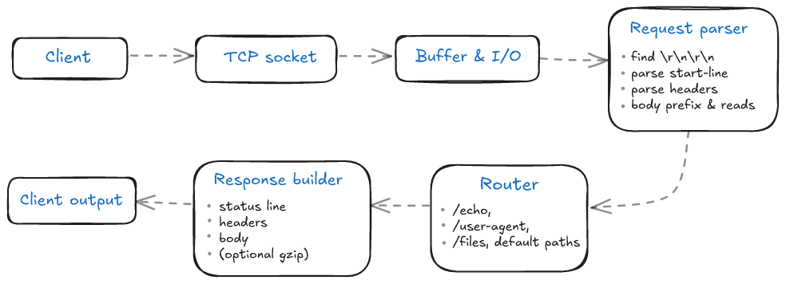

# 🧩 HTTP server from scratch in Python


Build a fully functional HTTP/1.1 server in Python, from the ground up—no frameworks, just sockets. This project is part of the Codecrafters "Build your own HTTP server" challenge.

---


## Features implemented

- **TCP server setup**: accepts and manages incoming socket connections.
- Basic HTTP **request parsing**: extracts method, path, and headers.
- **Request body handling**: reads bodies accurately using the Content-Length header, with timeout and error safeguards.
- **File endpoints**:
	- /files/{filename} – serves files for GET requests from the directory passed via --directory.
	- POST /files/{filename} – creates or overwrites files by writing the request body to disk.
- **User-Agent endpoint** (/user-agent): returns the client’s User-Agent header.
- **Echo endpoint** (/echo/{string}): returns the text sent in the path.
- Support **Content-Encoding (gzip)** for compression.
- **Concurrency**: handles multiple clients simultaneously with threads, using a semaphore to limit connections.
- **Logging and thread safety**: uses Lock and flush=True to keep console output readable and consistent.
- Graceful **connection handling**: proper socket closure and timeouts for robustness.
- **Error responses**: returns proper HTTP codes (400, 408, 413, 501) for malformed, incomplete, or oversized requests.


## Quick start

**Requirements:** Python 3.x

```sh
# Clone the repo
git clone https://github.com/CamilleOnoda/http-server-python
cd http-server-python

# Run the server (serves files from ./public)
python3 app/main.py --directory ./public
```

---


## How it works (behind the scenes)

To make the flow easier to visualize, here is the end-to-end path a request follows inside the server, each stage adding just enough structure to turn a byte stream into a valid HTTP response.


When you start the program, your computer opens a **listening socket** (like a receptionist waiting for phone calls).
That “phone line” stays open, ready to receive messages from any client that wants to talk.

When another program (like your browser or a command such as curl) connects, it sends a small text message called an **HTTP request**.
The request describes what the client wants: usually which resource to access (like */echo/hello*) and how (using methods such as **GET** or **POST**).

Your server reads this raw text, understands what’s being asked for, and sends back a reply: the **HTTP response**. That response also follows strict formatting rules so the client knows how to interpret it.

For example:
```
curl http://localhost:4221/echo/hello
```

1. **curl** (the client) dials your server’s “phone number” (port 4221) and says:
```
GET /echo/hello HTTP/1.1
Host: localhost
```
This means: “Hi server, I’d like the content at /echo/hello.”

2. Your server reads that message and decides what to send back.
Since **/echo/hello** means “repeat the word after /echo/,” it builds a reply:
```
HTTP/1.1 200 OK
hello
```

3. The client receives that reply, prints the text part (hello), and closes the connection.

In simple terms:

- The server = your program waiting and responding.
- The client = your browser or command line sending messages.
- HTTP = the “language” both sides speak to exchange text and files.


## Project structure
```
app/
 ├── server.py      # Main TCP server loop and connection handling
 ├── request.py     # HTTP request parsing (method, path, headers, body)
 ├── http.py        # Builds and sends HTTP responses
 ├── config.py      # Server configuration (timeouts, directories, etc.)
 ├── constants.py   # Shared constants (CRLF, status codes, etc.)
 ├── main.py        # Entrypoint to the Server and config flow
```

---

## How to test

**Automated tests:**
```sh
./test.sh
# or manually:
python3 -m unittest discover -s tests -p "test*.py"
```

**Manual testing with curl:**
```sh
curl http://localhost:4221/echo/hello
curl -H "User-Agent: test-agent" http://localhost:4221/user-agent
curl -X POST --data 'mydata' http://localhost:4221/files/test.txt
```

---

## Key learnings
- The full anatomy of **HTTP/1.1 requests and responses**.
- How to structure a **Request class** to separate parsing logic from I/O.
- Why **header normalization** (case-insensitive lookup) prevents subtle bugs.
- How to enforce content integrity using the **Content-Length header**.
- Difference between **concurrent and sequential handling** with Python threads.
- Practical use of **Lock, Semaphore, and socket timeouts** for stability.
- Why **daemon threads** are convenient for tests but risky in production.

---

## Tech stack
- Language: Python 3
- Core modules: socket, threading, pathlib, dataclasses, gzip
- Testing: manual with curl, unittest and automated Codecrafters tests

---

## Next steps
- Implement Transfer-Encoding: chunked for streamed bodies.
- Add persistent connections (HTTP/1.1 Keep-Alive).
- Improve structured logging and error output.
---

## Contributing

Pull requests and suggestions are welcome! For major changes, please open an issue first to discuss what you would like to change.
